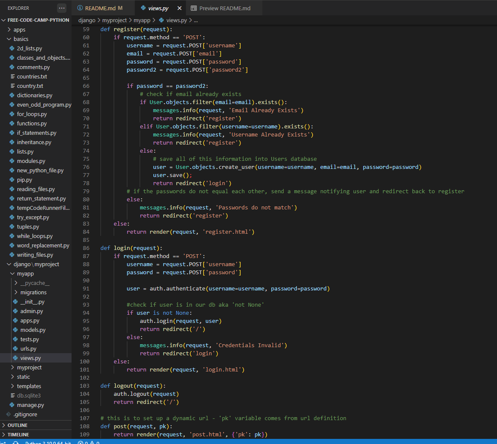

# Free Code Camp Python Course
  
   

  ## Table-of-Contents

  * [Description](#description)
  * [Installation](#installation)
  * [Usage](#usage)
   
  * [Contributing](#contributing)
  * [Tests](#tests)
  * [Questions](#questions)
  
  ## [Description](#table-of-contents)

  Relearning python basics, backend code in the Django environment and creating some practice apps.

  I started training in python in the Django environment in order to keep expanding my skills in development!

  A potential hiring manager will review this code and see my passion for becoming a highly experienced developer. 

  ## [Installation](#table-of-contents)

  N/A

  ## [Usage](#table-of-contents)
  
  Code snipet showing backend python logic for signing up and logging out a user:

  
   

  ## [Contributing](#table-of-contents)
  
  
  Thank you for your interest in helping out; however, I will not be accepting contributions from third parties.
    

  ## [Tests](#table-of-contents)

  N/A

  ## [Questions](#table-of-contents)

  Please contact me using the following links:

  [GitHub](https://github.com/mjgiannelli)

  [Email: giannellimj@gmail.com](mailto:giannellimj@gmail.com)
